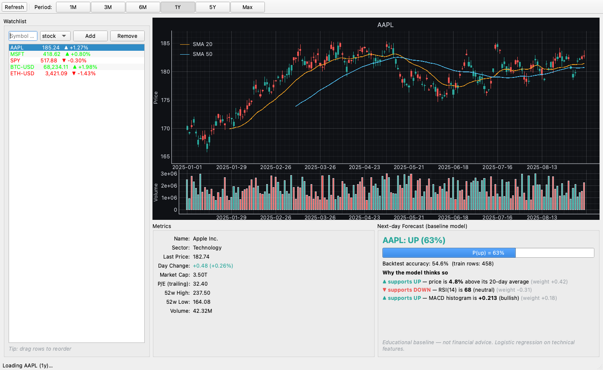

# Financial Dashboard

A desktop financial dashboard for stocks, ETFs and crypto built with PyQt6 and Yahoo Finance data. Interactive candlestick charts, drag-to-reorder watchlists, and a transparent next-day direction forecast trained per symbol.



> **Educational project — not financial advice.** See the [Disclaimers](#disclaimers) section before reading anything into the forecasts.

## Features

- **Live market data** via the [`yfinance`](https://github.com/ranaroussi/yfinance) library — stocks, ETFs, indices, crypto. No API key needed.
- **Interactive candlestick chart** (`pyqtgraph`) with SMA 20 / SMA 50 overlays, volume subplot, period buttons (1M / 3M / 6M / 1Y / 5Y / Max), and a **crosshair hover tooltip** that shows the date, OHLC, day change and volume for the bar under the cursor.
- **Watchlist sidebar** with add/remove, live auto-refresh every 30 seconds, and **drag-to-reorder** (persisted to SQLite).
- **Metrics panel** showing name, sector, market cap, trailing P/E, 52-week range and volume.
- **Next-day direction forecast** using a logistic regression trained per symbol on engineered technical features (RSI, MACD, returns, moving-average ratios, volume ratio, Bollinger position). The panel shows the probability, a rolling time-series-split backtest accuracy, and **plain-English reasons** for the call (e.g. *"price is 4.8% above its 20-day average"*, *"RSI(14) is 68 (neutral)"*).
- **Local SQLite cache** for watchlists and historical bars — the app keeps working on flaky networks.
- **Thread-pooled workers** — the UI never freezes on a network call.

## Installation

Requires **Python 3.10+**.

**Quick start (macOS / Linux):**

```bash
git clone https://github.com/JaaasperLiu/financial-dashboard.git
cd financial-dashboard
./run.sh
```

`run.sh` creates a local `.venv/`, installs dependencies from `requirements.txt`, and launches the app. On subsequent runs it reuses the venv and only reinstalls if `requirements.txt` has changed.

**Manual setup** (if you prefer to manage the environment yourself, or on Windows):

```bash
git clone https://github.com/JaaasperLiu/financial-dashboard.git
cd financial-dashboard
python -m venv .venv
source .venv/bin/activate          # Windows: .venv\Scripts\activate
pip install -r requirements.txt
python main.py
```

On first launch the app seeds a default watchlist (`AAPL`, `MSFT`, `SPY`, `BTC-USD`, `ETH-USD`) into a local SQLite file at `data_store/dashboard.sqlite`.

## Usage

- **Add a symbol** — type any Yahoo Finance ticker into the sidebar (e.g. `NVDA`, `^GSPC`, `BTC-USD`), pick `stock` or `crypto`, press Enter.
- **Reorder** — drag a row up or down in the watchlist; the new order persists.
- **Switch periods** — click `1M` / `3M` / `6M` / `1Y` / `5Y` / `Max` in the toolbar.
- **Hover the chart** — a crosshair appears with the date, OHLC, day change (color-coded) and volume for the bar under the cursor.
- **Read the forecast** — the bottom-right panel shows next-day `P(up)` along with the top three drivers explained in plain English.

## Project layout

```
financial-dashboard/
├── main.py                       # QApplication entry point
├── run.sh                        # one-shot launcher (venv + deps + run)
├── requirements.txt
├── app/
│   ├── config.py                 # paths, refresh intervals, defaults
│   ├── data/
│   │   ├── db.py                 # SQLite schema, CRUD, OHLCV cache
│   │   └── yahoo_client.py       # yfinance wrapper
│   ├── indicators.py             # SMA, EMA, RSI, MACD, Bollinger, features
│   ├── ml/
│   │   └── predictor.py          # logistic-regression forecast
│   └── ui/
│       ├── main_window.py
│       ├── watchlist_panel.py
│       ├── chart_view.py
│       ├── metrics_panel.py
│       └── prediction_panel.py
├── scripts/
│   └── generate_screenshot.py    # headless README screenshot renderer
├── tests/
│   ├── test_indicators.py
│   ├── test_db.py
│   └── test_predictor.py
└── docs/
    └── screenshot.png
```

## Running tests

```bash
pip install pytest
python -m pytest tests/ -q
```

The test suite covers indicator math, the SQLite layer, and the predictor's dataset shape and probability output. Tests do not import PyQt6, so they run fine on a headless CI runner.

## How the prediction works

1. Pull 2 years of daily OHLCV for the symbol.
2. Engineer features: 1/5/10-day log returns, RSI(14), MACD histogram, close-over-SMA20, close-over-SMA50, volume-over-20d-average, Bollinger band position.
3. Label: `1` if the *next* day's close is higher than today's close, else `0`.
4. Fit `StandardScaler` → `LogisticRegression` in a `sklearn.pipeline.Pipeline`.
5. Score the latest row → `P(up)`. Rank feature contributions (`coefficient × scaled_value`) and show the top three translated into plain English.
6. Report backtest accuracy from a 5-fold `TimeSeriesSplit` so the user can see whether the signal is meaningfully better than coin-flipping (it usually isn't).

Everything is deliberately simple and transparent. There is no deep learning. If you want to plug in something fancier, `app/ml/predictor.py` is where to start.

## Disclaimers

**Not financial advice.** The forecast is a toy baseline on technical features. Backtest accuracy on liquid equities typically lands around 50–55% — i.e., barely better than chance. Do not trade on it.

**`yfinance` is not an official Yahoo API.** It scrapes Yahoo Finance's public endpoints. This is fine for personal and educational use, but:
- Yahoo occasionally changes response shapes, which can break fields without warning.
- Commercial use may violate [Yahoo's Terms of Service](https://policies.yahoo.com/us/en/yahoo/terms/product-atos/apiforydn/index.htm).
- Tested with `yfinance` 0.2.x. If data suddenly looks wrong, bump the version first.

**Educational baseline model.** The prediction module is intentionally minimal so its behavior is auditable. It is not meant to compete with any real trading system.

## Tech stack

| Layer | Library |
|---|---|
| UI | PyQt6 |
| Charts | pyqtgraph |
| Data | yfinance |
| Storage | sqlite3 (stdlib) |
| ML | scikit-learn, pandas, numpy |

## Contributing

See [CONTRIBUTING.md](CONTRIBUTING.md).

## License

[MIT](LICENSE) © 2026 Jasper Liu
